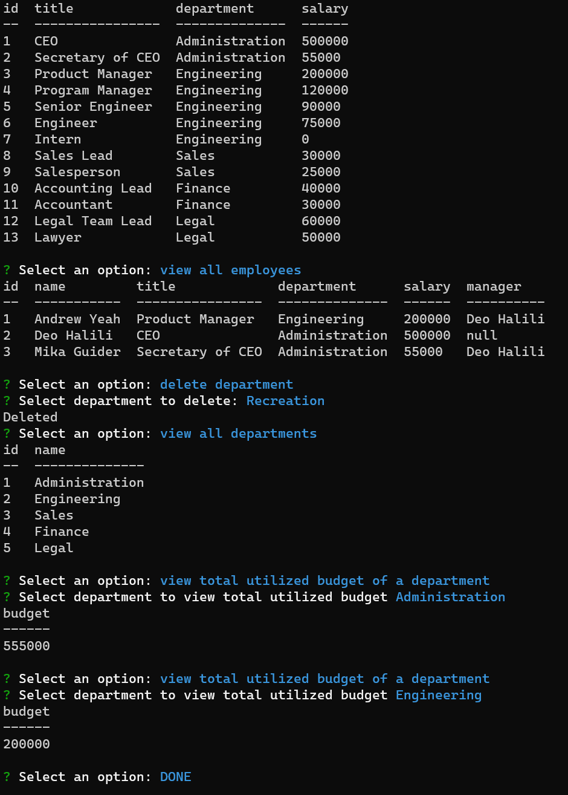

# Employee Tracker

## Table of contents

- [Overview](#overview)
  - [The challenge](#the-challenge)
  - [User Story](#user-story)
  - [Acceptance Criteria](#acceptance-criteria)
  - [Screenshot](#screenshot)
  - [Links](#links)
- [My process](#my-process)
  - [Built with](#built-with)
  - [What I learned](#what-i-learned)
  - [Continued development](#continued-development)
  - [Useful resources](#useful-resources)
- [Author](#author)

## Overview

### The challenge

The challenge of this assignment is to create a interface for an employee tracker database in which the user can perform CRUD actions upon the database.

### User Story

AS A business owner  
I WANT to be able to view and manage the departments, roles, and employees in my company  
SO THAT I can organize and plan my business  

### Acceptance Criteria

GIVEN a command-line application that accepts user input  
WHEN I start the application  
THEN I am presented with the following options: view all departments, view all roles, view all employees, add a department, add a role, add an employee, and update an employee role  
WHEN I choose to view all departments  
THEN I am presented with a formatted table showing department names and department ids  
WHEN I choose to view all roles  
THEN I am presented with the job title, role id, the department that role belongs to, and the salary for that role  
WHEN I choose to view all employees  
THEN I am presented with a formatted table showing employee data, including employee ids, first names, last names, job titles, departments, salaries, and managers that the employees report to  
WHEN I choose to add a department  
THEN I am prompted to enter the name of the department and that department is added to the database  
WHEN I choose to add a role  
THEN I am prompted to enter the name, salary, and department for the role and that role is added to the database  
WHEN I choose to add an employee  
THEN I am prompted to enter the employee’s first name, last name, role, and manager, and that employee is added to the database  
WHEN I choose to update an employee role  
THEN I am prompted to select an employee to update and their new role and this information is updated in the database  

### Screenshot



### Links

- Solution URL: [Github Repository](https://github.com/ayeh6/Employee-Tracker)
- Video Demo URL: [Video Link](https://drive.google.com/file/d/1kwX87diMjceWEZcmwE_j1qMSi-GwIAfG/view?usp=sharing)

## My process

### Built with

- Node
- mySQL
- Inquirer

### What I learned

I learned that in inquirer, you are able to use a function that returns an array as the choices parameter so that the choices can be dynamic. Only problem is that it doesn't seem to like to wait for queries to finish, so I would have to update object lists to have the data stored where the choices array can pull from.

```js
const updateManagerQuestion = [
    {
        message: `Select employee to designate as this employee's manager`,
        name: 'manager_id',
        type: 'list',
        choices: listEmployeesExceptSelf,
    }
];
```

```js
const listEmployeesExceptSelf = () => {
    const output = [];
    for(let i=0; i<employeeList.length; i++) {
        if(employeeList[i].getID() !== selectedEmployee.id) {
            const employee = {
                name: employeeList[i].getFirstName() + ' ' + employeeList[i].getLastName(),
                value: employeeList[i].getID()
            }
            output.push(employee);
        }
    }
    output.push({name: 'none', value: -1});
    return output;
}
```

### Continued development

As for continued development, I would like to have the choices be able to query instead of having to use space to store objects. I am not sure though how to do that, might have to involve promises since async await didn't work at all when it came to mysql2. Maybe using Sequelize would be more optimal.

### Useful resources

- [w3schools](https://www.w3schools.com/) - Helped me refresh my memory on certain SQL terms and syntaxes.
- [inquirer.js](https://www.npmjs.com/package/inquirer) - Documentation helped with understanding the parameters for the question objects.

## Author

- Website - [Andrew Yeh](https://ayeh6.github.io/Yeh-Andrew-Portfolio-Website/)
- LinkedIn - [/in/ayeh6](https://www.linkedin.com/in/ayeh6/)
